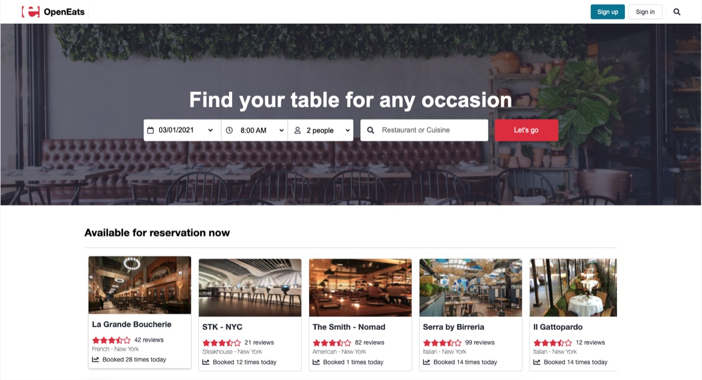
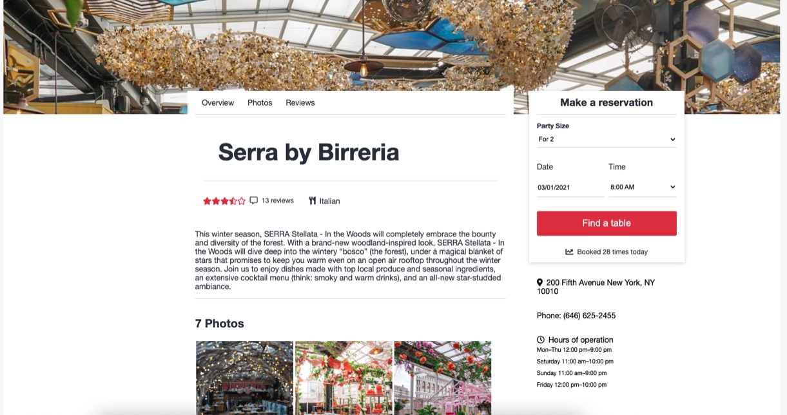

<h1 align="center">OpenEats</h1>

<p align="center">See our site hosted on heroku
<br><a href="https://openeats-app.herokuapp.com/">OpenEats</a></br></p>
&nbsp

## About

---

OpenEats is a clone of OpenTable. Users can view and search for restaurants in the database 
by name or cuising type. Signing up allows users to make reservations, see their dining history, and
save their favorite restaurants to their profile.

<p>&nbsp;</p>



## Technologies used

---

- JavaScript
- PostgreSQL
- Sequelize
- npm
- Express.js
- React
- Redux
- All styling was done with raw CSS, no frameworks were used.
<p>&nbsp;</p>

## Development Environment

---

- The database should be generated and seeded with the sequelize commands:
- `npx dotenv sequelize-cli db:create`
- `npx dotenv sequelize-cli db:migrate`
- `npx dotenv sequelize-cli db:seed:all`
- The project can be run locally through the command line with `npm start` in both the backend and frontend directories
<p>&nbsp;</p>

## Wiki Documentation

---

- [User Stories](https://github.com/sam-hearst/Comic-collection/wiki/User-Stories)
- [Front End Routes](https://github.com/KevKodes/open-eats/wiki/Frontend-Routes)
- [Database Schema](https://drawsql.app/aaprojects/diagrams/openeats)
- [Feature List](https://github.com/KevKodes/open-eats/wiki/Features)
- [API Documentation](https://github.com/KevKodes/open-eats/wiki/API-Documentation)
<p>&nbsp;</p>

## Key Technical Features

---



### React and Redux 


<p>&nbsp;</p>

## Obstacles

---


### Managing state with Redux
Prior to this project, I only had a few days of experience with Redux. As such, managing the shape of the state in my 
application became one of the biggest learning opportunities.

```javascript
export default function favoritesReducer(state = initialState, action) {
  switch (action.type) {
    case LOAD: {
      const userFavs = [];
      action.favoritesList.forEach(fav => {
        userFavs.push(fav)
      })
      return {
        ...state,
        list: [...userFavs]
      }
    }
    case SAVE: {
      const newFav = [action.fav]
      return {
        ...state,
        list: [...newFav]
      }
    }
    case REMOVE: {
      const updatedFavs = [...state.list].filter(fav => {
        return (parseInt(fav.restaurantId) !== parseInt(action.restId))
      })
      return {
        ...state,
        list: [...updatedFavs]
      }
    }
    default:
      return state;
  }

}
```


### Controling the components displayed based on user status
I was also able to take advantage of React's functionality to use conditionals
to display certain content based on user status and the user's associated state.

```javascript
let buttonArea = null;
  if (!sessionUser) {
    buttonArea = null
  } else {
    if (sessionUser && saved) {
      buttonArea = (
        <div className="restaurant-saved">
          <i className="far fa-bookmark"></i>
          <span>Restaurant saved!</span>
        </div>
      )
    } else {
      buttonArea = (
        <div
          className="save-restaurant"
          onClick={saveHandler}
        >
          <i className="far fa-bookmark"></i>
          <span>Save this restaurant</span>
        </div>
      )
    }
  }
```

<p>&nbsp;</p>

### Styling

Styling the website by hand was one of the most time intensive aspects of the
project. However, using React components in multiple locations allowed for 
duplicating styles that both sped up the process and led to stylistic 
continuity across the site.

<p>&nbsp;</p>

## Code Samples

```javascript
// Handle a form submission to save the data to state
const handleSubmit = (e) => {
  e.preventDefault();

  const restaurant = restaurantList.filter(rest => (
    rest.name.toLowerCase() === searchString.toLowerCase()
  ))[0]

  if (!restaurant) return setErrors(["Please select a valid restaurant name."])

  const reservation = {
    reservationTime,
    reservationDate,
    partySize
  }

  // send to the restaurant page but have the details of the form saved
  history.push({
    pathname: `/restaurants/${restaurant.id}`,
    state: {
      reservation
    }
  })
}

// Use the saved data to auto fill a form in another component
const location = useLocation();
const baseReservation = location?.state?.reservation;

```


## Future Improvements

This project was a sprint. Some features I would like to implement in the future are:
- Increasing the amount of data in the database by either seeding more data or connecting to an external API.
- Linking to the google maps API to show a mini map of individual restaurant locations.
- Adding the ablility for users to create reviews and ratings of restaurants.
- Updating the splash page to include multiple rows of restaurants of various types.
- Adding a search modal to allow users to search from any page on the site.
- Creating buttons for restaurant rows on the splash page for carousel functions in lieu of horizontal scrolling.
